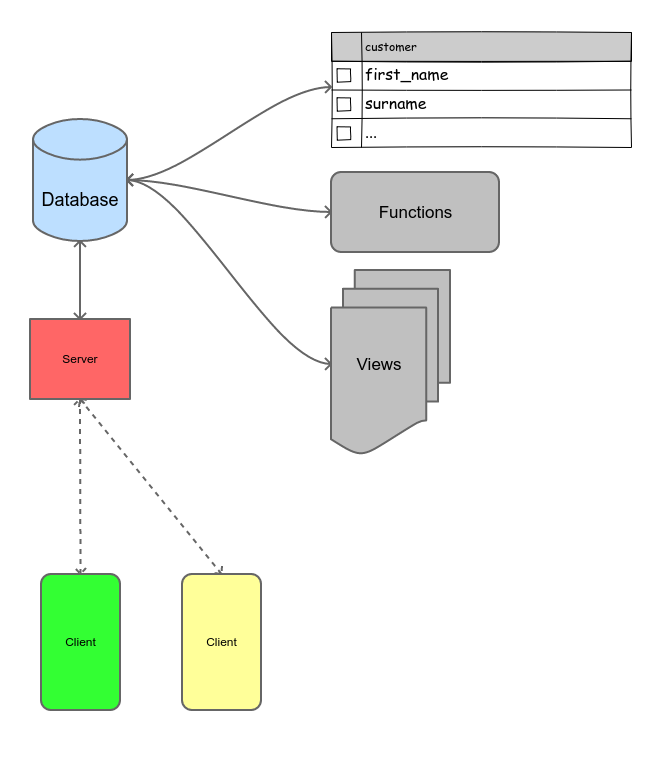
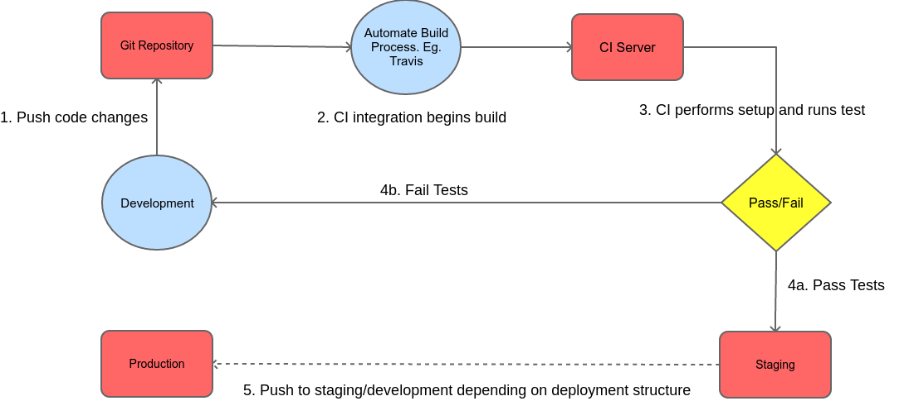

### Setup
#### Web Service API
The web application runs on Falcon. With an ORM from Peewee. To initiate; 
- configure the database parameters in `./loan_inc/config.py`
- first run the file `scripts.sql` in the directory `./db` on your chosen postgres database. (alternatively you can restore the db dump backup in db/dbloaninc.dump)
- do `pip install -r requirements.txt` to install the requirements needed for the web application to run

#### Mobile Application
The mobile application is build with Ionic v4 with React. So you begin by installing Ionic (i.e. if you already have node installed. If you don't try it with the awesome NVM!). The following steps should get it running. In your terminal do:
1. `npm install -g @ionic/cli native-run cordova-res`
2. `npm install`

### Running
To start the web application run the command below
- `gunicorn --reload loan_inc.app`

To the mobile application 
- `ionic serve` should kickstart a local development server and open a browser to display the app
- For logging in to the website, the demo agent created in the database uses <b>phone number</b> `0244444444` and <b>password</b> `pass` 
#### Implemented endpoints
- `/customers` to fetch all users 
- `/customers/{customer_id}` to fetch user with customer id = customer_id
- `/loans` to fetch all loans given to customers
- `/loans/{customer_id}` to fetch loans given to customer with id = customer_id
- `/transactions` to fetch all transactions. On POST add a new transaction

- `/auth` to authenticate agent for login with phone number and password (provided above)

### System Architecture

The design of the application tries to reduce the dependency of server side framework and translates basic CRUD and read operations to the database where it is most reliable. This ensures a server-side agnostic design where the business logic remains closer to the data. 
The transactions `search` and `add` stored procedures in the database is a typical example of this. Although in other areas the peewee ORM is used. To demonstrate the capability of having both options. Though the prior one is advised.

### CI Integration

